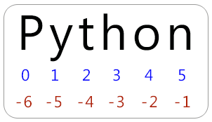

# O Básico

## Python Zen

- Princípios de design;
- Em seu **ipython**, digite `import this`;

<div class="center">
Deveria haver um -- de preferência apenas um -- modo óbvio de fazê-lo.
</div>

- Código óbvio para um iniciante $\Rightarrow$ Código *Pythonic*;

## Formatação de Espaço em Branco

- Sem chaves ou begin's e end's;
- Python usa indentação:

```python
for i in [1, 2, 3, 4, 5]:
  print(i)                   # first line in "for i" block
  for j in [1, 2, 3, 4, 5]:
    print(j)                 # first line in "for j" block
    print(i + j)             # last line in "for j" block
  print (i)                   # last line in "for i" block
print("done looping")
```

## Formatação de Espaço em Branco

- Código legível, porém ...
- É necessário ter muito cuidado com a formatação
- Espaço em branco é ignorado dentro de parênteses e colchetes (útil para linhas longas):

```python
long_winded_computation = (1 + 2 + 3 + 4 + 5 + 6 + 7 + 8 + 9 + 10 + 11 + 12 +
                           13 + 14 + 15 + 16 + 17 + 18 + 19 + 20)

# and for making code easier to read:

list_of_lists = [[1, 2, 3], [4, 5, 6], [7, 8, 9]]

easier_to_read_list_of_lists = [ [1, 2, 3],
                                 [4, 5, 6],
                                 [7, 8, 9] ]
```

## Formatação de Espaço em Branco

- É possível, embora seja raro, utilizarmos `\` para indicar continuidade em uma nova linha:

```python
two_plus_three = 2 + \
                 3
```

```python
for i in [1, 2, 3, 4, 5]:

    # notice the blank line
    print(i)
```

- Colar código no Python Shell pode se tornar perigoso.
  - IPython pode resolver isso.

## Módulos

- Para utilizar recursos não carregados por padrão no Python, utilize módulo:

```python
import re
my_regex = re.compile("[0-9]+", re.I)
```

```python
import re as regex
my_regex = regex.compile("[0-9]+", regex.I)
```

```python
import matplotlib.pyplot as plt
```

```python
from collections import defaultdict, Counter
lookup = defaultdict(int)
my_counter = Counter()
```

## Módulos {.build}

- Se você for um programador malvado, você pode importar um módulo inteiro no seu *espaço de nomes*:

```python
from re import *
```

- Porém ...

```python
match = 10
from re import *      # uh oh, re has a match function
print(match)          # "<function re.match>"
```

## Módulos (mais exemplos) {.smaller}

```python
# some_module.py
PI = 3.14159

def f(x):
    return x + 2

def g(a, b):
    return a + b
```

```python
import some_module
result = some_module.f(5)
pi = some_module.PI

from some_module import f, g, PI
result = g(5, PI)

import some_module as sm
from some_module import PI as pi, g as gf

r1 = sm.f(pi)
r2 = gf(6, pi)
```

## Operadores binários e comparações

```python
5 - 7
12 + 21.5
5 <= 2
```

```python
a = [1, 2, 3]
b = a
c = list(a)
a is b     # ??
a is not c # ??
```

```python
a == c     # ??
```

```python
a = None
a is None
```

## Funções

- Regras que recebem zero ou mais parâmetros para gerar uma saída:

```python
def double(x):
  """this is where you put an optional docstring
  that explains what the function does.
  for example, this function multiplies its input by 2"""
  return x * 2
```

## Funções de primeira classe

- No Python, as funções são de **primeira classe**:
  - Podem ser atribuídas a variáveis ou passadas como parâmetros para outras funções:

```python
def apply_to_one(f):
  """calls the function f with 1 as its argument"""
  return f(1)

my_double = double # refers to the previously defined function
x = apply_to_one(my_double) # equals 2
```

## Lambdas

- É fácil criar pequenas funções anônimas ("*lambdas*"):

```python
y = apply_to_one(lambda x: x + 4) # equals 5
```

- Você pode atribuir lambdas a variáveis, embora isso o torne um programador malvado:

```python
another_double = lambda x: 2 * x      # don't do this
def another_double(x): return 2 * x   # do this instead
```

## Parâmetros *Default*

- Funções podem receber valores default para zero ou mais argumentos:

```python
def my_print(message="my default message"):
  print(message)

my_print("hello") # prints 'hello'
my_print()        # prints 'my default message'
```

- Ás vezes, especificar argumentos por nome é mais fácil:

```python
def subtract(a=0, b=0):
  return a - b

subtract(10, 5)  # returns 5
subtract(0, 5)   # returns -5
subtract(b=5)    # same as previous
```

## Strings

```python
single_quoted_string = 'data science'
double_quoted_string = "data science"

# Python uses backslashes to encode special characters. For example:
tab_string = "\t"  # represents the tab character
len(tab_string)    # is 1

# If you want backslashes as backslashes (which you might in Windows directory
# names or in regular expressions), you can create raw strings using r"":
not_tab_string = r"\t"  # represents the characters '\' and 't'
len(not_tab_string)     # is 2

#You can create multiline strings using triple-[double-]-quotes:
multi_line_string = """This is the first line.
and this is the second line
and this is the third line"""
```

## F-string

- "Novo" recurso do python 3.6;
- Como adicionar ou substituir valores em uma string:

```python
full_name1 = first_name + " " + last_name             # string addition
full_name2 = "{0} {1}".format(first_name, last_name)  # string.format
```

- Com `f-string`:

```python
full_name3 = f"{first_name} {last_name}"
```

## Exceções

- Se algo der errado, uma **exceção** será provocada:

```python
try:
  print(0 / 0)
except ZeroDivisionError:
  print("cannot divide by zero")
```

## Listas

- Certamente, uma das estruturas de dados fundamentais do Python mais utilizadas;
- Uma coleção ordenada de itens:

```python
integer_list = [1, 2, 3]
heterogeneous_list = ["string", 0.1, True]
list_of_lists = [ integer_list, heterogeneous_list, [] ]

list_length = len(integer_list)   # equals 3
list_sum = sum(integer_list)      # equals 6
```

## Listas

- Acessando elementos por índice:

```python
x = [0, 1, 2, 3, 4, 5, 6, 7, 8, 9]
zero = x[0]     # equals 0, lists are 0-indexed
one = x[1]      # equals 1
nine = x[-1]    # equals 9, 'Pythonic' for last element
eight = x[-2]   # equals 8, 'Pythonic' for next-to-last element

x[0] = -1       # ??
```

## Listas

<div class="centered">

</div>

## Listas

- Utilize `:` no índice para "fatiar" a lista:

```python
first_three = x[:3]                # [-1, 1, 2]
three_to_end = x[3:]               # [3, 4, ..., 9]
one_to_four = x[1:5]               # [1, 2, 3, 4]
last_three = x[-3:]                # [7, 8, 9]
without_first_and_last = x[1:-1]   # [1, 2, ..., 8]
copy_of_x = x[:]                   # [-1, 1, 2, ..., 9]
```

## Listas

- Ou ainda com `::` indicando o passo:

```python
every_third = x[::3]                 # [-1, 3, 6, 9]
five_to_three = x[5:2:-1]            # [5, 4, 3]
```

## Listas

- Para verificar o pertencimento de elementos a uma lista, podemos utilizar o operador `in`:

```python
1 in [1, 2, 3]    # True
0 in [1, 2, 3]    # False
```

- Embora, para listas grandes, esse operador seja lento.

## Listas

- É fácil concatenar listas:


```python
x = [1, 2, 3]
x.extend([4, 5, 6]) # x is now [1,2,3,4,5,6]
```

- Se você não quiser modificar `x`, pode utilizar **adição** de listas:

```python
x = [1, 2, 3]
y = x + [4, 5, 6] # y is [1, 2, 3, 4, 5, 6]; x is unchanged
```

## Listas

- Frequentemente iremos anexar itens ao final da lista:

```python
x = [1, 2, 3]
x.append(0)  # x is now [1, 2, 3, 0]

y = x[-1]    # equals 0
z = len(x)   # equals 4
```

- Sabendo o tamanho da lista, é possível "desempacotá-la":

```python
x, y = [1, 2]  # now x is 1, y is 2

_, y = [1, 2]  # now y == 2, didn't care about the first element
```

## Tuplas

- Primas **imutáveis** das listas:

```python
my_list = [1, 2]
my_tuple = (1, 2)
other_tuple = 3, 4
my_list[1] = 3     # my_list is now [1, 3]

try:
  my_tuple[1] = 3
except TypeError:
  print("cannot modify a tuple")
```

## Tuplas

- Tuplas são uma forma conveniente de retornar múltiplos valores em uma função:

```python
def sum_and_product(x, y):
  return (x + y),(x * y)

sp = sum_and_product(2, 3)      # equals (5, 6)
s, p = sum_and_product(5, 10)   # s is 15, p is 50
```

- Tuplas (e listas) podem ser utilizadas para *atribuição múltipla*:

```python
x, y = 1, 2   # now x is 1, y is 2
x, y = y, x   # Pythonic way to swap variables; now x is 2, y is 1
```

## Dicionários

- Mais uma estrutura fundamental;
- Associa *chaves* com *valores*:

```python
empty_dict = {}                       # Pythonic
empty_dict2 = dict()                  # less Pythonic
grades = { "Joel" : 80, "Tim" : 95 }  # dictionary literal

joels_grade = grades["Joel"]          # equals 80
```

- Operador `in` também funciona para dicionários (mas aqui ele é rápido):

```python
joel_has_grade = "Joel" in grades     # True
kate_has_grade = "Kate" in grades     # False
```

## Dicionários

- Ocorre uma exceção caso uma chave não existente seja acessada:

```python
try:
 kates_grade = grades["Kate"]
except KeyError:
  print("no grade for Kate!")
```

- O método `.get()` retorna um valor padrão caso a chave não exista:

```python
joels_grade = grades.get("Joel", 0)   # equals 80
kates_grade = grades.get("Kate", 0)   # equals 0
no_ones_grade = grades.get("No One")  # default default is None
```

## Dicionários

- Atribuição de valores é como esperado:

```python
grades["Tim"] = 99          # replaces the old value
grades["Kate"] = 100        # adds a third entry
num_students = len(grades)  # equals 3
```

- Dicionários são comumente utilizados na representação de estruturas de dados mais complexas:

```python
tweet = {
  "user" : "joelgrus",
  "text" : "Data Science is Awesome",
  "retweet_count" : 100,
  "hashtags" : ["#data", "#science", "#datascience", "#awesome", "#yolo"]
}
```

## Dicionários

- Além de procurar por chaves específicas, é possível trabalhar com o conjunto dos dados:


```python
tweet_keys = tweet.keys()      # list of keys
tweet_values = tweet.values()  # list of values
tweet_items = tweet.items()    # list of (key, value) tuples
"user" in tweet_keys           # True, but uses a slow list in
"user" in tweet                # more Pythonic, uses faster dict in
"joelgrus" in tweet_values     # True
```

- Chaves de dicionários **precisam** ser imutáveis (como tuplas e strings):
  - Na verdade, precisam ser `hashables`. Por quê?

## defaultdict

- Imagine um pequeno algoritmo para contar a ocorrência de palavras de um texto:

```python
word_counts = {}
for word in document:
  if word in word_counts:
    word_counts[word] += 1
  else:
    word_counts[word] = 1
```

## defaultdict

- Ou ainda:

```python
word_counts = {}
for word in document:
  try:
    word_counts[word] += 1
  except KeyError:
    word_counts[word] = 1
```

## defaultdict

- Mais uma opção:

```python
word_counts = {}
for word in document:
  previous_count = word_counts.get(word, 0)
  word_counts[word] = previous_count + 1
```

## defaultdict

- Todas as opções anteriores são interessantes, porém causam uma certa diminuição na legibilidade do código;
- `defaultadict` cria um dicionário que atribui um valor inicial a uma chave em seu primeiro acesso:

```python
from collections import defaultdict

word_counts = defaultdict(int)       # int() produces 0
for word in document:
  word_counts[word] += 1
```

- `defaultdict` recebe uma função como argumento;
- A função deve retornar o valor a ser atribuído no primeiro acesso de uma chave.

## defaultdict

```python
dd_list = defaultdict(list)            # list() produces an empty list
dd_list[2].append(1)                   # now dd_list contains {2: [1]}

dd_dict = defaultdict(dict)            # dict() produces an empty dict
dd_dict["Joel"]["City"] = "Seattle"    # { "Joel" : { "City" : Seattle"}}

dd_pair = defaultdict(lambda: [0, 0])
dd_pair[2][1] = 1                      # now dd_pair contains {2: [0,1]}
```

## counter

- Um `counter` conta coisas :)

```python
from collections import Counter

c = Counter([0, 1, 2, 0])        # c is (basically) { 0 : 2, 1 : 1, 2 : 1 }
```

- Resolve facilmente o problema de contar palavras:

```python
word_counts = Counter(document)
```

- Possui, ainda, métodos interessantes, como o `most_common`:

```python
# print the 10 most common words and their counts
for word, count in word_counts.most_common(10):
  print(word, count)
```

## Conjuntos

- Mais uma estrutura de dados fundamental;
- É como uma lista ou uma tupla, só que diferente:
  - Representa conjuntos de elementos **distintos**;

```python
s = set()
s.add(1)    # s is now { 1 }
s.add(2)    # s is now { 1, 2 }
s.add(2)    # s is still { 1, 2 }
x = len(s)  # equals 2
y = 2 in s  # equals True
z = 3 in s  # equals False
```

- `s = {}` não inicializa um conjunto, por quê?


- O operador `in` é muito rápido quando aplicado a conjuntos (por quê?);

## Conjuntos

- Ótima forma de encontrar os elementos distintos em uma coleção:

```python
item_list = [1, 2, 3, 1, 2, 3]
num_items = len(item_list)           # 6
item_set = set(item_list)            # {1, 2, 3}
num_distinct_items = len(item_set)   # 3
distinct_item_list = list(item_set)  # [1, 2, 3]
```

## Controle de Fluxo

- O básico de sempre (mas lembre-se do `:`):

```python
if 1 > 2:
  message = "if only 1 were greater than two..."
elif 1 > 3:
  message = "elif stands for 'else if'"
else:
  message = "when all else fails use else (if you want to)"
```

- Comparações "ternárias" também são possíveis, mas use com moderação:

```python
parity = "even" if x % 2 == 0 else "odd"
```

## Controle de Fluxo - Laços

- Embora exista o `while`:

```python
x = 0
while x < 10:
  print(f"{x} is less than 10")
  x += 1
```

- O uso de `for` que itera sobre uma coleção é muito mais comum e preferível:

```python
for x in range(10):
  print(f"{x} is less than 10")
```

## Controle de Fluxo - Laços

- `break` e `continue` estão disponíveis também:

```python
for x in range(10):
  if x == 3:
    continue # go immediately to the next iteration
  if x == 5:
    break # quit the loop entirely
  print(x)
```

## Veracidade

- Mais uma vez, nada fora do esperado:

```python
one_is_less_than_two = 1 < 2       # equals True
true_equals_false = True == False  # equals False
```

```python
x = None
assert x == None    # prints True, but is not Pythonic
assert x is None    # prints True, and is Pythonic
```

## Veracidade

- Todos os itens a seguir são considerados falsos:

```python
False
None
[]      # (an empty list)
{}      # (an empty dict)
""
set()
0
0.0
```

## Veracidade - inicialização de variáveis

- Considere o seguinte exemplo:

```python
s = some_function_that_returns_a_string()
if s:
    first_char = s[0]
else:
    first_char = ""
```

- Uma alternativa seria:

```python
first_char = s and s[0]
```

- Operador `and` retorna o último operando se o verdadeiro. 

## Veracidade - inicialização de variáveis

- Agora uma opção com `or`:

```python
safe_x = x or 0
```

- É o mesmo que:

```python
safe_x = x if x is not None else 0
```

- Operador `or` retorna o primeiro operando verdadeiro.

## Veracidade

- O Python possui as funções `all` e `any`:
  - `all` retorna True se todos os elementos de uma coleção são "verdadeiros";
  - `any` retorna True se ao menos um elemento de uma coleção é "verdadeiro";

```python
all([True, 1, { 3 }])  # True
all([True, 1, {}])     # False, {} is falsy
any([True, 1, {}])     # True, True is truthy
all([])                # True, no falsy elements in the list
any([])                # False, no truthy elements in the list
```

## Exercícios

1. Escreva uma função que converte horas, minutos e segundos em um número total de segundos.
2. Escreva uma função que reconhece palíndromos.
3. Escreva uma função `soma_de_quadrados(xs)` que recebe uma lista de números `xs` e retorna a soma dos quadrados dos números na lista. Por exemplo `soma_dos_quadrados([2, 3, 4])` deve retorna 4+9+16 que é 29.
4. Escreva uma função recursiva que calcula o fatorial de um número.
5. Escreva uma função recursiva para inverter uma lista.

# Não tão básico<br>Parte 3

## Ordenação

```python
x = [4,1,2,3]
y = sorted(x)  # is [1,2,3,4], x is unchanged
x.sort()       # now x is [1,2,3,4]
```

```python
# sort the list by absolute value from largest to smallest
x = sorted([-4,1,-2,3], key=abs, reverse=True) # is [-4,3,-2,1]
```

```python
# sort the words and counts from highest count to lowest
wc = sorted(word_counts.items(),
            key=lambda word_and_count: word_and_count[1],
            reverse=True)
```

## List Comprehensions

- Recurso bastante interessante da linguagem;
- Forma de escrever transformações em listas (ou dicionários, ou conjuntos):

```python
even_numbers = [x for x in range(5) if x % 2 == 0]  # [0, 2, 4]
squares = [x * x for x in range(5)]                 # [0, 1, 4, 9, 16]
even_squares = [x * x for x in even_numbers]        # [0, 4, 16 ]
```

- Similarmente com dicionários e conjuntos:

```python
square_dict = { x : x * x for x in range(5) } # { 0:0, 1:1, 2:4, 3:9, 4:16 }
square_set = { x * x for x in [1, -1] }       # { 1 }
```

- O carácter `_` indica uma variável anônima, que propositalmente não será utilizada:

```python
zeroes = [0 for _ in even_numbers] # has the same length as even_numbers
```

## List Comprehensions aninhadas

- É possível utilizar o recurso de list comprehensions com múltiplos laços:

```python
pairs = [(x, y)
         for x in range(10)
         for y in range(10)] # 100 pairs (0,0) (0,1) ... (9,8), (9,9)
```

- É comum a inclusão de condicionais ao final dos laços:

```python
strings = ['a', 'as', 'bat', 'car', 'dove', 'python']
[x.upper() for x in strings if len(x) > 2]
```

## List Comprehensions mais exemplos

```python
all_data = [['John', 'Emily', 'Michael', 'Mary', 'Steven'],
            ['Maria', 'Juan', 'Javier', 'Natalia', 'Pilar']]

result = [name
          for names in all_data
          for name in names
          if name.count('e') >= 2]
# result = ['Steven']
```

- Perceba que laços mais internos podem utilizar valores de laços mais externos.

## List Comprehensions mais exemplos

```python
some_tuples = [(1, 2, 3), (4, 5, 6), (7, 8, 9)]
flattened = [x for tup in some_tuples for x in tup]
# flattened = [1, 2, 3, 4, 5, 6, 7, 8, 9]
```

```python
[[x for x in tup] for tup in some_tuples]  # tuples to list
```

## Testes automáticos com assert

- Com o comando `assert` podemos realizar pequenos testes para verificar se nossas rotinas se comportam de maneira correta:
  - Ao falhar, o `assert` retorna uma exceção do tipo `AssertionError`.

```python
assert 1 + 1 == 2
assert 1 + 1 == 2, "1 + 1 should equal 2 but didn't"

# exemplo com função
def smallest_item(xs):
    return min(xs)

assert smallest_item([10, 20, 5, 40]) == 5
assert smallest_item([1, 0, -1, 2]) == -1
```

## Orientação a Objetos {.smaller}

```python
# by convention, we give classes PascalCase names
class CountingClicker:
  """A class can/should have a docstring, just like a function"""

  # these are the member functions
  # every one takes a first parameter "self" (another convention)
  def __init__(self, count = 0):
    """This is the constructor."""
    self.count = count

  def __repr__(self):
    return f"CountingClicker(count={self.count})"

  def click(self, num_times = 1):
      """Click the clicker some number of times."""
      self.count += num_times

  def read(self):
      return self.count

  def reset(self):
      self.count = 0
```

## Orientação a Objetos

```python
clicker = CountingClicker()
assert clicker.read() == 0, "clicker should start with count 0"
clicker.click()
clicker.click()
assert clicker.read() == 2, "after two clicks, clicker should have count 2"
clicker.reset()
assert clicker.read() == 0, "after reset, clicker should be back to 0"
```

## Orientação a Objetos - Herança

```python
# A subclass inherits all the behavior of its parent class.
class NoResetClicker(CountingClicker):
  # This class has all the same methods as CountingClicker

  # Except that it has a reset method that does nothing.
  def reset(self):
      pass

clicker2 = NoResetClicker()
assert clicker2.read() == 0
clicker2.click()
assert clicker2.read() == 1
clicker2.reset()
assert clicker2.read() == 1, "reset shouldn't do anything"
```

## Geradores

- Um Gerador é uma estrutura de dados que pode ser iterada (como uma lista), mas que gera os elementos apenas no momento em que são requisitados (*lazyly*);
  - Em que casos isso é interessante?

```python
def generate_range(n):
    i = 0
    while i < n:
        yield i   # every call to yield produces a value of the generator
        i += 1

for i in generate_range(10):
  print(f"i: {i}")
```

## Geradores

- Uma outra forma de criar geradores é através de *comprehensions* envoltos em parênteses:

```python
lazy_evens_below_20 = (i for i in range(20) if i % 2 == 0)
```

## Geradores - Mais exemplos

```python
evens_below_20 = (i for i in generate_range(20) if i % 2 == 0)

# None of these computations *does* anything until we iterate
data = natural_numbers()
evens = (x for x in data if x % 2 == 0)
even_squares = (x ** 2 for x in evens)
even_squares_ending_in_six = (x for x in even_squares if x % 10 == 6)
# and so on
```

## Iteradores

- E para iterar sobre uma lista, mas mantendo informações sobre o índice de cada elemento? Como faz?

```python
# not Pythonic
for i in range(len(documents)):
  document = documents[i]
  do_something(i, document)

# also not Pythonic
i = 0
for document in documents:
  do_something(i, document)
  i += 1
```

## Iteradores

```python
for i, document in enumerate(documents):
  do_something(i, document)
```
- Similarmente, se quisermos apenas os índices:

```python
for i in range(len(documents)): do_something(i)   # not Pythonic
for i, _ in enumerate(documents): do_something(i) # Pythonic
```

## Aleatoriedade

```python
import random

four_uniform_randoms = [random.random() for _ in range(4)]

# [0.8444218515250481, # random.random() produces numbers
# 0.7579544029403025, # uniformly between 0 and 1
# 0.420571580830845, # it's the random function we'll use
# 0.25891675029296335] # most often
```

```python
random.seed(10)         # set the seed to 10
print(random.random())  # 0.57140259469
random.seed(10)         # reset the seed to 10
print(random.random())  # 0.57140259469 again
```

```python
random.randrange(10)     # choose randomly from range(10) = [0, 1, ..., 9]
random.randrange(3, 6)   # choose randomly from range(3, 6) = [3, 4, 5]
```

## Aleatoriedade

```python
up_to_ten = range(10)
random.shuffle(up_to_ten)
print(up_to_ten)
# [2, 5, 1, 9, 7, 3, 8, 6, 4, 0] (your results will probably be different)
```

```python
my_best_friend = random.choice(["Alice", "Bob", "Charlie"]) # "Bob" for me
```

```python
lottery_numbers = range(60)
winning_numbers = random.sample(lottery_numbers, 6) # [16, 36, 10, 6, 25, 9]
```

```python
four_with_replacement = [random.choice(range(10))
                         for _ in range(4)]
# [9, 4, 4, 2]
```

## Expressões Regulares

```python
import re
print(all([                                # all of these are true, because
  not re.match("a", "cat"),                # * 'cat' doesn't start with 'a'
  re.search("a", "cat"),                   # * 'cat' has an 'a' in it
  not re.search("c", "dog"),               # * 'dog' doesn't have a 'c' in it
  3 == len(re.split("[ab]", "carbs")),     # * split on a or b to ['c','r','s']
  "R-D-" == re.sub("[0-9]", "-", "R2D2")   # * replace digits with dashes
  ])) # prints True
```

## Zip e Desempacotamento de Argumentos

- Por vezes, é necessário combinar listas, elemento a elemento:

```python
list1 = ['a', 'b', 'c']
list2 = [1, 2, 3]
zip(list1, list2)          # is [('a', 1), ('b', 2), ('c', 3)]
```

- E a operação inversa:

```python
pairs = [('a', 1), ('b', 2), ('c', 3)]
letters, numbers = zip(*pairs)
```

## Zip e Desempacotamento de Argumentos

- O `*` "desempacota" os elementos de uma lista em argumentos de função.

```python
def add(a, b): return a + b

add(1, 2)     # returns 3
add([1, 2])   # TypeError!
add(*[1, 2])  # returns 3
```

## args e kwargs

- Especificação de funções que recebem um número arbitrário de argumentos:

```python
def magic(*args, **kwargs):
  print("unnamed args:", args)
  print("keyword args:", kwargs)

magic(1, 2, key="word", key2="word2")
# prints
# unnamed args: (1, 2)
# keyword args: {'key2': 'word2', 'key': 'word'}
```

```python
def other_way_magic(x, y, z):
  return x + y + z

x_y_list = [1, 2]
z_dict = { "z" : 3 }
print(other_way_magic(*x_y_list, **z_dict)) # 6
```

## Anotações de Tipo

- Python tem tipagem dinâmica;
- Porém, na versão 3.6 foi adicionada a possibilidade de anotações de tipo:

```Python
def add(a: int, b: int) -> int:
    return a + b

add(10, 5)           # you'd like this to be OK
add("hi ", "there")  # you'd like this to be not OK
```

## Anotações de tipo - mais exemplos

```python
from typing import List  # note capital L

def total(xs: List[float]) -> float:
  t = 0.0
  for i in xs:
    t += i
  return t

from typing import Optional

values: List[int] = []
best_so_far: Optional[float] = None  # allowed to be either a float or None
```

## Exercícios
1. Utilize List Comprehension para elevar ao quadrado todos os elementos de uma lista;
2. Utilize List Comprehension para retirar elementos palíndromos de uma lista de strings;
3. Utilize List Comprehension para, dadas as listas A e B, criar uma lista C composta apenas pelos elementos presentes em ambas A e B;

# IPython

## IPython básico

```shell
$ ipython
Python 3.6.0 | packaged by conda-forge | (default, Jan 13 2017, 23:17:12)
Type "copyright", "credits" or "license" for more information.

IPython 5.1.0 -- An enhanced Interactive Python.
?         -> Introduction and overview of IPython's features.
%quickref -> Quick reference.
help      -> Python's own help system.
object?   -> Details about 'object', use 'object??' for extra details.

In [1]: %run hello_world.py
Hello world

In [2]:
```

## Introspection

```
In [8]: b = [1, 2, 3]

In [9]: b?
Type:       list
String Form:[1, 2, 3]
Length:     3
Docstring:
list() -> new empty list
list(iterable) -> new list initialized from iterable's items
```

## Introspection

```
In [10]: print?
Docstring:
print(value, ..., sep=' ', end='\n', file=sys.stdout, flush=False)

Prints the values to a stream, or to sys.stdout by default.
Optional keyword arguments:
file:  a file-like object (stream); defaults to the current sys.stdout.
sep:   string inserted between values, default a space.
end:   string appended after the last value, default a newline.
flush: whether to forcibly flush the stream.
Type:      builtin_function_or_method
```

## Introspection {.smaller}

```python
def add_numbers(a, b):
    """
    Add two numbers together

    Returns
    -------
    the_sum : type of arguments
    """
    return a + b
```

```python
In [11]: add_numbers?
Signature: add_numbers(a, b)
Docstring:
Add two numbers together

Returns
-------
the_sum : type of arguments
File:      <ipython-input-9-6a548a216e27>
Type:      function
```

## Introspection

```python
In [12]: add_numbers??
Signature: add_numbers(a, b)
Source:
def add_numbers(a, b):
    """
    Add two numbers together

    Returns
    -------
    the_sum : type of arguments
    """
    return a + b
File:      <ipython-input-9-6a548a216e27>
Type:      function
```

## Comando %run 

```python
def f(x, y, z):
    return (x + y) / z

a = 5
b = 6
c = 7.5

result = f(a, b, c)
```

```python
In [14]: %run ipython_script_test.py
```

```python
In [15]: c
Out [15]: 7.5

In [16]: result
Out[16]: 1.4666666666666666
```

## Executando código da área de transferência

```python
x = 5
y = 7
if x > 5:
    x += 1

    y = 8
```

```python
In [17]: %paste
x = 5
y = 7
if x > 5:
    x += 1

    y = 8
## -- End pasted text --
```

## Executando código da área de transferência

```python
In [18]: %cpaste
Pasting code; enter '--' alone on the line to stop or use Ctrl-D.
:x = 5
:y = 7
:if x > 5:
:    x += 1
:
:    y = 8
:--
```

# Referências

- GRUS, Joel - Data Science do Zero: Primeiras Regras com Python, Editora Alta Books, 1a Edição, 2016;
- McKinney, Wes - Python para Análise de Dados: Tratamento de Dados com Pandas, Numpy e IPython, Editora Novatec, 1a Edição, 2019;
