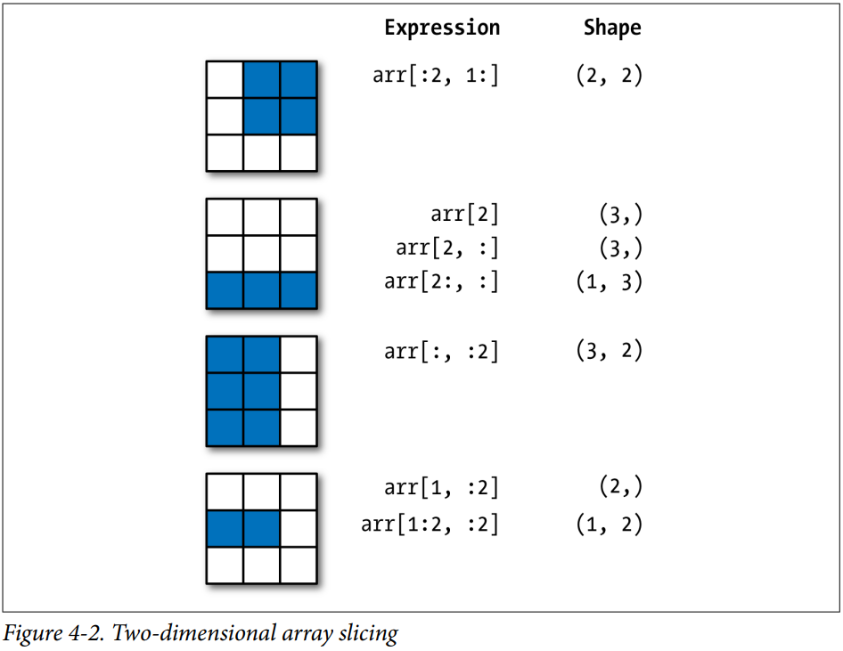

# NumPy

## O que é NumPy

- Pacote fundamental para computação científica com Python;
- Funcionalidades principais:
  - Objeto Array para itens homogêneos e arbitrários;
  - **Operações rápidas sobre arrays**;
  - Transformadas de Fourier e Algebra linear e geração de números aleatórios;

## Importando

- Costuma-se importar a biblioteca `numpy` com a *alias* `np`:

```python
import numpy as np

np?
```

- Comparando o objeto *array numpy* com uma lista python:

```python
my_arr = np.arange(1000000)
my_list = list(range(1000000))

%time for _ in range(10): my_arr2 = my_arr * 2
%time for _ in range(10): my_list2 = [x * 2 for x in my_list]
```

    CPU times: user 58.1 ms, sys: 35.9 ms, total: 94 ms
    Wall time: 95.4 ms
    CPU times: user 1.1 s, sys: 270 ms, total: 1.38 s
    Wall time: 1.41 s

- Muito mais rápido! Por quê?

# NumPy ndarray: Um objeto Array Multidimensional

## Criando um array aleatório

```python
import numpy as np

# Generate some random data
data = np.random.randn(2, 3)
data
```

    array([[-0.2047,  0.4789, -0.5194],
           [-0.5557,  1.9658,  1.3934]])


## Operações aritméticas sobre arrays

```python
data * 10
data + data
```

    array([[-0.4094,  0.9579, -1.0389],
           [-1.1115,  3.9316,  2.7868]])

## Propriedades shape e dtype

- **shape**: tupla que indica o formato do array (tamanho de cada dimensão);
- **dtype**: indica o tipo de dados armazenado pelo array:
  - tipos definidos pela própria `numpy`.


```python
data.shape
data.dtype
```

    dtype('float64')

## Criando `ndarrays`


```python
data1 = [6, 7.5, 8, 0, 1]
arr1 = np.array(data1)
arr1
```

    array([6. , 7.5, 8. , 0. , 1. ])

```python
data2 = [[1, 2, 3, 4], [5, 6, 7, 8]]
arr2 = np.array(data2)
arr2
```

    array([[1, 2, 3, 4],
           [5, 6, 7, 8]])
           
## Criando ndarrays

```python
arr2.ndim     # 2
arr2.shape    # (2,4)
```

```python
arr1.dtype       # dtype('float64')
arr2.dtype       # dtype('int64')
```

## Criando ndarrays: outras formas


```python
np.zeros(10)
np.zeros((3, 6))
np.empty((2, 3, 2))
```

- `np.empty` não garante valores nulos.

```python
np.arange(15)
```

    array([ 0,  1,  2,  3,  4,  5,  6,  7,  8,  9, 10, 11, 12, 13, 14])


## Tipos de Dados para ndarrays

- É possível estipular o tipo de dados a ser utilizado no array:
  - A melhor conversão será utilizada.

```python
arr1 = np.array([1, 2, 3], dtype=np.float64)
arr2 = np.array([1, 2, 3], dtype=np.int32)
arr1.dtype         # dtype('float64')
arr2.dtype         # dtype('int32')
```

- `astype` converte arrays para outros tipos de dados:
  - um novo array é criado.

```python
arr = np.array([1, 2, 3, 4, 5])
arr.dtype
float_arr = arr.astype(np.float64)
float_arr.dtype                     # dtype('float64')
```

## Mais exemplos de conversão de tipos

- De float para int, a parte decimal é truncada:

```python
arr = np.array([3.7, -1.2, -2.6, 0.5, 12.9, 10.1])
arr
arr.astype(np.int32)
```

    array([ 3, -1, -2,  0, 12, 10], dtype=int32)

- Existe ainda a conversão automática de string para números:

```python
numeric_strings = np.array(['1.25', '-9.6', '42'], dtype=np.string_)
numeric_strings.astype(float)
```
    array([ 1.25, -9.6 , 42.  ])
    
## dtype é, em si, um tipo de dado

```python
int_array = np.arange(10)
calibers = np.array([.22, .270, .357, .380, .44, .50], dtype=np.float64)
int_array.astype(calibers.dtype)
```

    array([0., 1., 2., 3., 4., 5., 6., 7., 8., 9.])

# Aritmética com arrays NumPy

## Operações aritméticas

- Ótima funcionalidade da biblioteca;
- Operações aritméticas de todos os tipos podem ser aplicadas em arrays (inclusive multidimensionais) sem a necessidade de laços:
  - Muito mais rápido;

```python
arr = np.array([[1., 2., 3.], [4., 5., 6.]])
arr
arr * arr
arr - arr
```

- Operações com escalares são propagadas para cada elemento:

```python
1 / arr
arr ** 0.5
```

## Operações booleanas

- As comparações entre arrays de mesmo tamanho, resultam em array booleanos:

```python
arr2 = np.array([[0., 4., 1.], [7., 2., 12.]])
arr2
arr2 > arr
```

    array([[False,  True, False],
           [ True, False,  True]])

- Será utilizada juntamente com o recurso de **indexação booleana**.

## Indexação e Fatiamento

- Bastante similar à indexação e fatiamento padrão das listas Python:

```python
arr = np.arange(10)
```

    array([ 0,  1,  2,  3,  4, 5, 6, 7,  8,  9])

```python
arr[5]
arr[5:8]
arr[5:8] = 12
```

    array([ 0,  1,  2,  3,  4, 12, 12, 12,  8,  9])


## Fatiamento não gera cópia

- Atenção: fatiamento de `ndarray` não gera copia (são apenas *views*):
  - Alterações realizadas serão persistidas no array original.

```python
arr_slice = arr[5:8]
arr_slice
```

    array([12, 12, 12])


```python
arr_slice[1] = 12345
arr
```

    array([    0,     1,     2,     3,     4,    12, 12345,    12,     8,
               9])

## Fatiamento não gera cópia

- Mais um exemplo:

```python
arr_slice[:] = 64
arr
```

    array([ 0,  1,  2,  3,  4, 64, 64, 64,  8,  9])
    
    
- Para gerar uma cópia, é possível utilizar o método `.copy`:

```python
arr[5:8].copy()
```

## Arrays multidimensionais

```python
arr2d = np.array([[1, 2, 3], [4, 5, 6], [7, 8, 9]])
arr2d[2]
```

    array([7, 8, 9])

- Indexação multidimensional tem duas formas;

```python
arr2d[0][2]
arr2d[0, 2]
```

## Mais de duas dimensões

- É possível ter arrays de N dimensões:

```python
arr3d = np.array([[[1, 2, 3], [4, 5, 6]], [[7, 8, 9], [10, 11, 12]]])
arr3d
```

    array([[[ 1,  2,  3],
            [ 4,  5,  6]],
    
           [[ 7,  8,  9],
            [10, 11, 12]]])


```python
arr3d[0]
```

    array([[1, 2, 3],
           [4, 5, 6]])

## Exemplos de fatiamento multidimensional 

```python
arr2d = np.array([[1, 2, 3], [4, 5, 6], [7, 8, 9]])
arr2d[:2]
```

    array([[1, 2, 3],
           [4, 5, 6]])

```python
arr2d[:2, 1:]
```

    array([[2, 3],
           [5, 6]])

## Exemplos de fatiamento multidimensional 

```python
arr2d[1, :2]
```

    array([4, 5])


```python
arr2d[:2, 2]
```

    array([3, 6])


## Exemplos de fatiamento multidimensional 

```python
arr2d[:, :1]
```

    array([[1],
           [4],
           [7]])


- Atribuições a uma expressão de fatia é aplicada a toda seleção:

```python
arr2d[:2, 1:] = 0
arr2d
```

    array([[1, 0, 0],
           [4, 0, 0],
           [7, 8, 9]])


## Exemplos de fatiamento multidimensional 

<div class="centered">
{ width=60% }
</div>

## Indexação Booleana

```python
names = np.array(['Bob', 'Joe', 'Will', 'Bob', 'Will', 'Joe', 'Joe'])
data = np.random.randn(7, 4)
```

    array(['Bob', 'Joe', 'Will', 'Bob', 'Will', 'Joe', 'Joe'], dtype='<U4')

    array([[ 0.0929,  0.2817,  0.769 ,  1.2464],
           [ 1.0072, -1.2962,  0.275 ,  0.2289],
           [ 1.3529,  0.8864, -2.0016, -0.3718],
           [ 1.669 , -0.4386, -0.5397,  0.477 ],
           [ 3.2489, -1.0212, -0.5771,  0.1241],
           [ 0.3026,  0.5238,  0.0009,  1.3438],
           [-0.7135, -0.8312, -2.3702, -1.8608]])

## Indexação Booleana

- Já conhecemos as operações de comparação sobre arrays:

```python
names == 'Bob'
```

    array([ True, False, False,  True, False, False, False])
    
- O interessante é a utilização desse resultado como indexador:

```python
data[names == 'Bob']
```

    array([[ 0.0929,  0.2817,  0.769 ,  1.2464],
           [ 1.669 , -0.4386, -0.5397,  0.477 ]])

- Para cara `True`, o elemento da posição é adicionado à view de saída.

## Indexação Booleana: outros exemplos

- Diferentes construções com as funcionalidades vistas até aqui são possíveis:

```python
data[names == 'Bob', 2:]
```

```python
data[names == 'Bob', 3]
```

- Indexação com operações de negação:

```python
names != 'Bob'
data[~(names == 'Bob')]
```

## Indexação Booleana: máscaras

```python
mask = (names == 'Bob') | (names == 'Will')
mask
data[mask]
```

    array([[ 0.0929,  0.2817,  0.769 ,  1.2464],
           [ 1.3529,  0.8864, -2.0016, -0.3718],
           [ 1.669 , -0.4386, -0.5397,  0.477 ],
           [ 3.2489, -1.0212, -0.5771,  0.1241]])
           
- Operador `|` é diferente de `or`.

## Indexação Booleana: atribuições

- Atribuições com o auxílio de indexação booleana são aplicadas a todas os elementos com valor `True`:

```python
data[data < 0] = 0
data
```

    array([[0.0929, 0.2817, 0.769 , 1.2464],
           [1.0072, 0.    , 0.275 , 0.2289],
           [1.3529, 0.8864, 0.    , 0.    ],
           [1.669 , 0.    , 0.    , 0.477 ],
           [3.2489, 0.    , 0.    , 0.1241],
           [0.3026, 0.5238, 0.0009, 1.3438],
           [0.    , 0.    , 0.    , 0.    ]])

## Indexação Booleana: atribuições

```python
data[names != 'Joe'] = 7
data
```

    array([[7.    , 7.    , 7.    , 7.    ],
           [1.0072, 0.    , 0.275 , 0.2289],
           [7.    , 7.    , 7.    , 7.    ],
           [7.    , 7.    , 7.    , 7.    ],
           [7.    , 7.    , 7.    , 7.    ],
           [0.3026, 0.5238, 0.0009, 1.3438],
           [0.    , 0.    , 0.    , 0.    ]])


## Fancy Indexing

- Nome que se dá para o uso de arrays de inteiros na indexação:

```python
arr = np.empty((8, 4))
for i in range(8):
    arr[i] = i
arr
```

    array([[0., 0., 0., 0.],
           [1., 1., 1., 1.],
           [2., 2., 2., 2.],
           [3., 3., 3., 3.],
           [4., 4., 4., 4.],
           [5., 5., 5., 5.],
           [6., 6., 6., 6.],
           [7., 7., 7., 7.]])

## Fancy Indexing

```python
arr[[4, 3, 0, 6]]
```

    array([[4., 4., 4., 4.],
           [3., 3., 3., 3.],
           [0., 0., 0., 0.],
           [6., 6., 6., 6.]])


```python
arr[[-3, -5, -7]]
```

    array([[5., 5., 5., 5.],
           [3., 3., 3., 3.],
           [1., 1., 1., 1.]])


## Funções Universais (Ufuncs)

- Funções aplicáveis a arrays super rápidas (implementadas em C):

```python
arr = np.arange(10)
arr
np.sqrt(arr)
np.exp(arr)
```

```python
x = np.random.randn(8)
y = np.random.randn(8)
np.maximum(x, y)
```

```python
arr = np.random.randn(7) * 5
remainder, whole_part = np.modf(arr)
```

## Exemplo: expressando lógica condicional com operações de array

- Considere o seguinte:

```python
xarr = np.array([1.1, 1.2, 1.3, 1.4, 1.5])
yarr = np.array([2.1, 2.2, 2.3, 2.4, 2.5])
cond = np.array([True, False, True, True, False])
```

```python
result = [(x if c else y)
          for x, y, c in zip(xarr, yarr, cond)]
result
```

    [1.1, 2.2, 1.3, 1.4, 2.5]

## Exemplo: expressando lógica condicional com operações de array

- Mesma funcionalidade com NumPy:

```python
result = np.where(cond, xarr, yarr)
result
```

    array([1.1, 2.2, 1.3, 1.4, 2.5])


## Exemplo: expressando lógica condicional com operações de array

```python
arr = np.random.randn(4, 4)
arr
arr > 0
np.where(arr > 0, 2, -2)
```

    array([[-2, -2, -2, -2],
           [ 2,  2, -2,  2],
           [ 2,  2,  2, -2],
           [ 2, -2,  2,  2]])

## Outras funcionalidades interessantes

```python
arr.mean()
np.mean(arr)
arr.sum()
arr.any()
arr.all()
arr.sort()
np.unique(arr)
from numpy.linalg import inv, qr
```

# Exemplo: passeios aleatórios

## Versão Python sem NumPy

```python
import random
position = 0
walk = [position]
steps = 1000
for i in range(steps):
    step = 1 if random.randint(0, 1) else -1
    position += step
    walk.append(position)
```

## Visualizando

```python
import matplotlib.pyplot  as plt
plt.plot(walk[:100])
plt.show()
```

## Versão Python com NumPy

```python
nsteps = 1000
draws = np.random.randint(0, 2, size=nsteps)
steps = np.where(draws > 0, 1, -1)
walk = steps.cumsum()
```

- O que faz o método `cumsum()`?

## Extraindo informações

```python
walk.min()
walk.max()
```

- O que o trecho abaixo faz?

```python
(np.abs(walk) >= 10).argmax()
```

## Simulando vários passeios

```python
nwalks = 5000
nsteps = 1000
draws = np.random.randint(0, 2, size=(nwalks, nsteps)) # 0 or 1
steps = np.where(draws > 0, 1, -1)
walks = steps.cumsum(1)
walks
```

    array([[  1,   0,   1, ...,   8,   7,   8],
           [  1,   0,  -1, ...,  34,  33,  32],
           [  1,   0,  -1, ...,   4,   5,   4],
           ...,
           [  1,   2,   1, ...,  24,  25,  26],
           [  1,   2,   3, ...,  14,  13,  14],
           [ -1,  -2,  -3, ..., -24, -23, -22]])

# Exercícios

## Exercícios

1)) Escreva um programa NumPy que cria um array de duas dimensões com 1's nas bordas e 0's no centro:

    [[ 1.  1.  1.  1.  1.]                                                  
     [ 1.  0.  0.  0.  1.]                                                  
     [ 1.  0.  0.  0.  1.]                                                  
     [ 1.  0.  0.  0.  1.]                                                  
     [ 1.  1.  1.  1.  1.]]
     
2)) Escreva um programa NumPy que cria uma borda de 0's em volta de um array de duas dimensões (consulte o método `np.pad`):

    [[ 0.  0.  0.  0.  0.]                                                  
     [ 0.  1.  1.  1.  0.]                                                  
     [ 0.  1.  1.  1.  0.]                                                  
     [ 0.  1.  1.  1.  0.]                                                  
     [ 0.  0.  0.  0.  0.]]
     
---
     
3)) Escreva um programa NumPy que converte uma array com valores de temperaturas em Graus Celcius para Graus Farenheit.

    $`C = (5*(F-32))/9`$

4)) Escreva um programa NumPy que cria um array bidimensional de 0's e 1's gerando um padrão de "tabuleiro de xadrez". Por exemplo:

    [[0 1 0 1 0 1 0 1]                                                      
     [1 0 1 0 1 0 1 0]                                                      
     [0 1 0 1 0 1 0 1]                                                      
     [1 0 1 0 1 0 1 0]                                                      
     [0 1 0 1 0 1 0 1]                                                      
     [1 0 1 0 1 0 1 0]                                                      
     [0 1 0 1 0 1 0 1]                                                      
     [1 0 1 0 1 0 1 0]]
     
# Referências

- McKinney, Wes - Python para Análise de Dados: Tratamento de Dados com Pandas, Numpy e IPython, Editora Novatec, 1a Edição, 2019;
