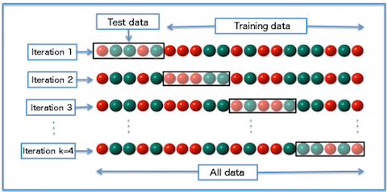

# SciKit-Learn

## O que é o SciKit-Learn

- Aprendizado de máquina para Python:
  - Ferramentas simples e eficientes para Mineração e Análise de Dados;
  - Acessível para todos, e reusável em vários contextos;
  - Construído sobre `NumPy`, `SciPy` e `matplotlib`;
  - Código aberto, usável comercialmente - Licença BSD;

- Biblioteca estável e bem estabelecida:
  - Aceita pela comunidade científica.

# Aprendizado de Máquina (Machine Learning)

## O  Problema da aprendizagem

* Considera um conjunto de $`n`$ amostras de dado e então tentar prever propriedades de
  dados desconhecidos;
* Se cada amostra é mais do que um simples número, ou seja, uma entrada
  multidimensional, dizemos que temos vários atributos ou **features**;

## Categorias de Aprendizado

- Aprendizado Supervisionado:
  - Quando os dados possuem os atributos que desejamos prever;
  - Nesse caso, o problema pode ser:
    - **Classificação**;
    - **Regressão**;

## Aprendizado Supervisionado - Classificação

- Amostras de dados de duas ou mais classes;
- Queremos aprender a partir de dados já classificados;
- Classificar amostras futuras desconhecidas;
- Exemplo:
  - Reconhecer dígitos numéricos escritos à mão:
    - Algoritmo é treinado a partir de uma série de imagens de dígitos classificados
      com o número que representam;

## Aprendizado Supervisionado - Regressão

- É quando o valor a ser predito consiste de uma ou mais variáveis contínuas (não apenas classes);
- Exemplo:
  - Prever o tamanho de Salmões a partir da sua idade e peso.

## Aprendizado Não Supervisionado

- O Aprendizado não supervisionado é aquele em que o conjunto de dados não inclui o 
  valor que queremos prever;
- O objetivo de problemas como este seria a descoberta de grupos de valores similares;
  - Clusterização;

## Conjuntos de Treinamento e Testes

- Aprendizado de máquina está relacionado com o aprendizado sobre dados para aplicação
  em dados novos;
- É muito comum, nesse meio, realizar a divisão dos dados para a avaliação dos algoritmos:
  - **Conjunto de Treino**: dados utilizados para a aprendizagem do modelo;
  - **Conjunto de Testes**: dados utilizados para verificar se o modelo apresenta resultados esperados.

## Utilizando o SciKit-Learn

- A biblioteca `sklearn` é composta por vários itens, dentre eles:
  - `sklearn.datasets`;
  - `sklearn.feature_extraction`;
  - `sklearn.metrics`;
  - `sklearn.naive_bayes`;
  - `sklearn.neural_network`;
  - ...
- Mais aqui: https://sklearn.org/modules/classes.html

## Utilizando o SciKit-Learn

- Portanto, a biblioteca tem uma aparato gigantesco (submódulos) para atender qualquer
  necessidade de Aprendizado de Máquina;
- Entretanto, isso significa que é necessário conhecer tudo isso;
- Conhecer "por demanda" é uma boa saída;
- Para facilitar, alguns padrões entre os submódulos são seguidos:
  - API transformer, por exemplo;

## Utilizando o SciKit-Learn

- Em geral, costumas-se carregar apenas os módulos separados:

```python
from sklearn import datasets, naive_bayes
```

## Datasets

- Para facilitar o trabalho com Aprendizado de Máquina, o `sklearn` possuí o submódulo
  `datasets`;
- Composto por uma série de bases dados para testes algoritmos:
  - Dígitos escritos à mão;
  - Dados sobre a flor Iris para identificação de suas espécies;
  - Dentre vários outros.

## Carregando um dataset

```python
from sklearn import datasets
iris = datasets.load_iris()
digits = datasets.load_digits()
```

Verifique os itens `.data` e `.target` dos datasets.

## Formato do vetor de features

- Os classificadores do `sklearn` sempre esperam que as features sejam passadas
  em um vetor unidimensional;
- Verifique a diferença entre `digits.data` e `digits.image`;

```python
n_samples = len(digits.images)
data = digits.images.reshape((n_samples, -1))
```

## Aprendizado e predição

- No scikit-learn um "estimador" (*estimator*) é um objeto Python que implementa os
  métodos:
  - `fit(X,y)` - treina o modelo;
  - `predict(T)` - calcula predições;

## Exemplo de Estimador

- `sklearn.svm.SVC` implementa **Support Vector Classification**;

```python
from sklearn import svm
clf = svm.SVC(gamma=0.001, C=100.)
```

- Mais adiante falaremos sobre os parâmetros do classificador.

## Classificando o dataset de dígitos

```python
clf.fit(digits.data[:-1], digits.target[:-1])
```

```python
clf.predict(digits.data[-1:])

import matplotlib.pyplot as plt 
plt.imshow(digits.images[-1], cmap=plt.cm.gray_r)
```

# Exemplos

## Reconhecimento de Dígitos

https://scikit-learn.org/stable/auto_examples/classification/plot_digits_classification.html#sphx-glr-auto-examples-classification-plot-digits-classification-py

Ou

[Código no repositório](https://gitlab.com/iaa003-alexkutzke/material/blob/master/codes/sklearn/digits/plot_digits_classification.py)

## Carregando as bibliotecas

```python
# Standard scientific Python imports
import matplotlib.pyplot as plt

# Import datasets, classifiers and performance metrics
from sklearn import datasets, svm, metrics
```

## Carregando o dataset

```python
digits = datasets.load_digits()
```

## Exibindo 4 imagens do dataset

```python
images_and_labels = list(zip(digits.images, digits.target))
for index, (image, label) in enumerate(images_and_labels[:4]):
    plt.subplot(2, 4, index + 1)
    plt.axis('off')
    plt.imshow(image, cmap=plt.cm.gray_r, interpolation='nearest')
    plt.title('Training: %i' % label)
```

## Reshaping e classificador

```python
# To apply a classifier on this data, we need to flatten the image, to
# turn the data in a (samples, feature) matrix:
n_samples = len(digits.images)
data = digits.images.reshape((n_samples, -1))

# Create a classifier: a support vector classifier
classifier = svm.SVC(gamma=0.001)
```

## Fitting (treinamento)

```python
# We learn the digits on the first half of the digits
classifier.fit(data[:n_samples // 2], digits.target[:n_samples // 2])
```

Separando a outra metade:

```python
# Now predict the value of the digit on the second half:
expected = digits.target[n_samples // 2:]
predicted = classifier.predict(data[n_samples // 2:])
```

## Obtendo métrica

- Submódulo `sklearn.metrics`:

```python
print("Classification report for classifier %s:\n%s\n"
      % (classifier, metrics.classification_report(expected, predicted)))
print("Confusion matrix:\n%s" % metrics.confusion_matrix(expected, predicted))
```

## Exibindo imagens e suas predições

```python
images_and_predictions = list(zip(digits.images[n_samples // 2:], predicted))
for index, (image, prediction) in enumerate(images_and_predictions[:4]):
    plt.subplot(2, 4, index + 5)
    plt.axis('off')
    plt.imshow(image, cmap=plt.cm.gray_r, interpolation='nearest')
    plt.title('Prediction: %i' % prediction)

plt.show()
```

## Classificação de Iris

- Tente realizar a mesma classificação, mas agora com o dataset `iris`:
  - Deu certo?
  - Se sim, tente outro classificador como o `sklearn.naive_bayes.GaussianNB`.

## Trabalhando com Texto
https://scikit-learn.org/stable/tutorial/text_analytics/working_with_text_data.html

ou

[Código no repositório](https://gitlab.com/iaa003-alexkutzke/material/blob/master/codes/sklearn/20newsgroup/exemplo.py)

## Carregando o dataset 20 newsgroup

- Dataset composto por várias mensagens de grupos de notícia classificadas por tema;
- Carregaremos apenas 4 temas;

```python
categories = ['alt.atheism', 'soc.religion.christian',
              'comp.graphics', 'sci.med']
from sklearn.datasets import fetch_20newsgroups
twenty_train = fetch_20newsgroups(subset='train', categories=categories, 
                                  shuffle=True, random_state=42)
```

- Possui o mesmo formato de outros datasets já vistos.

## Carregando o dataset 20 newsgroup

```python
twenty_train.target_names

twenty_train.target[:10]

for t in twenty_train.target[:10]:
    print(twenty_train.target_names[t])
```

## Extraindo features

- Na aula passada, extraímos features de mensagens de email:
  - Verificamos a presença de palavras nos assuntos das mensagens;
- Uma outra forma de retirar features de textos é a contagem de palavras (*bag os words*);

## Bag of words
  - A forma mais simples de produzir um *bag of words*:
    - Atribuir um inteiro `j` para cada palavra $`w_{j}`$ encontrada entre os documentos;
    - Para cada documento `i` contar as ocorrências de $`w_{j}`$ e armazenar em `X[i,j]`;

  - Algum problema?
    - Espaço na memória para **100 mil palavras distintas** (valor típico):
      - Cerca de **4GB** para **10 mil documentos** (4 bytes por `float32`);
      - Mas a maioria dos dados é 0;
  - Solução:
    - Matriz esparsa;
    - SciKit-learn já possui implementação dessa estrutura;

## Tokens com scikit-learn

- `CountVectorizer` realiza pré-processamento, *tokenizing*, filtragem de *stopwords* e contagem de palavras de uma só vez:
  - Utiliza estrutura `scipy.sparse` para armazenar dados;

```python
from sklearn.feature_extraction.text import CountVectorizer
count_vect = CountVectorizer()
X_train_counts = count_vect.fit_transform(twenty_train.data)
```

```python
X_train_counts.shape
count_vect.vocabulary_.get(u'algorithm')
```

## Transformer API 

- Reparou o método `fit_transform`?
- Ele faz parte de um padrão do scikit-learn, conhecido como *Transformer API*;
  - Todos os Objetos que implementam essa API possuem os métodos fit e transform:
    - `fit`: realiza a absorção dos dados para um modelo;
    - `transform`: realiza transformações necessárias sobre os dados e mantém essas informações salvas para aplicação da mesma transformação em outros conjuntos de dados;
    - `fit_transform`: chamada de `fit` e `transform` em sequência;
- Em alguns objetos o método `fit` não faz nada. Existe apenas para manter o padrão da API.

## De ocorrências para frequências

- A simples quantidade de ocorrências de uma palavra pode levar a conclusões incorretas sobre um texto:
  - Por que?
...
- Documentos maiores possuem mais palavras.

## De ocorrências para frequências

- Para evitar problemas como esse, podemos utilizar duas métricas comuns na área de Recuperação de Informação (*Information Retrieval*):
  - Term Frequency (tf): divisão do número de ocorrências pelo total de palavras no documento;
  - Term Frequecy/Inverse Document Frequency (tf-idf): diminui o peso de palavras que aparecem em muitos documentos;
- Para isso, podemos utilizar outro transformador do `sklearn`:

## TfidfTransformer

```python
from sklearn.feature_extraction.text import TfidfTransformer
tf_transformer = TfidfTransformer(use_idf=False).fit(X_train_counts)
X_train_tf = tf_transformer.transform(X_train_counts)
X_train_tf.shape
```

Ou apenas (agora com idf):

```python
tfidf_transformer = TfidfTransformer()
X_train_tfidf = tfidf_transformer.fit_transform(X_train_counts)
X_train_tfidf.shape
```
 
## Treinando um Classificador

- Utilizaremos, em um primeiro momento, um classificador da família `naive_bayes`:

```python
from sklearn.naive_bayes import MultinomialNB
clf = MultinomialNB().fit(X_train_tfidf, twenty_train.target)
```

## Prevendo temas de textos

- Os dados de teste devem receber o mesmo processamento de contagem de palavras:
  - Daí a vantagem da Transformer API:

```python
docs_new = ['God is love', 'OpenGL on the GPU is fast']
X_new_counts = count_vect.transform(docs_new)
X_new_tfidf = tfidf_transformer.transform(X_new_counts)

predicted = clf.predict(X_new_tfidf)

for doc, category in zip(docs_new, predicted):
    print('%r => %s' % (doc, twenty_train.target_names[category]))
```

## Criando um Pipeline

- O `sklearn` possui uma forma de facilitar a execução de todas essas etapas (extração
  de dados, filtragem, treinamento, ...):
  - O **Pipeline**;
- Entenda um Pipeline como uma sequencia de objetos python que serão chamados para
  realizar uma tarefa;
- Pipelines também implementam a Transformer API:
  - Ou seja, possuem os métodos `fit`, `transform` e, se for um Estimator,  `predict`;
  
## Exemplo Pipeline

```python
from sklearn.pipeline import Pipeline
text_clf = Pipeline([('vect', CountVectorizer()),
                     ('tfidf', TfidfTransformer()),
                     ('clf', MultinomialNB()),
])

text_clf.fit(twenty_train.data, twenty_train.target)  
text_clf.predict(docs_new) # dados de teste podem ser passados sem processamento
```

## Avaliando o desempenho

- Existem diferentes formas de avaliar o desempenho de um classificador:

```python
import numpy as np
twenty_test = fetch_20newsgroups(subset='test', categories=categories,
                                 shuffle=True, random_state=42)
docs_test = twenty_test.data
predicted = text_clf.predict(docs_test)
np.mean(predicted == twenty_test.target) 
```

## Utilizando outro classificador

- Troquemos o naive bayes por support vector machine:
  - Qual se sai melhor?

```python
from sklearn.linear_model import SGDClassifier
text_clf = Pipeline([('vect', CountVectorizer()),
                     ('tfidf', TfidfTransformer()),
                     ('clf', SGDClassifier(loss='hinge', penalty='l2',
                                           alpha=1e-3, random_state=42,
                                           max_iter=5, tol=None)),
])
text_clf.fit(twenty_train.data, twenty_train.target)  

predicted = text_clf.predict(docs_test)
np.mean(predicted == twenty_test.target)
```

## Outra forma de avaliar performance

```python
from sklearn import metrics
print(metrics.classification_report(twenty_test.target, predicted,
    target_names=twenty_test.target_names))
    
metrics.confusion_matrix(twenty_test.target, predicted)
```

## Ajustando parâmetros automagicamente

- Beleza! Mas e os parâmetros do algoritmo? Caem do céu?
  - Na maioria dos casos "sim";
  - Valores *default* são bastante razoáveis na maioria do tempo;
- Por outro lado, conhecimento do problema e do algoritmo, pode dar algumas pistas
  sobre ajustes nos parâmentros;
  
- Entretanto, há outra saída: força bruta; :)

## GridSearchCV

- Em resumo, basta elencar os parâmetros a serem testados e aguardar o resultado:

```python
from sklearn.model_selection import GridSearchCV
parameters = {'vect__ngram_range': [(1, 1), (1, 2)],
              'tfidf__use_idf': (True, False),
              'clf__alpha': (1e-2, 1e-3),
}
```

## Utilizando o GridSearchCV

```python
gs_clf = GridSearchCV(text_clf, parameters, n_jobs=-1)

gs_clf = gs_clf.fit(twenty_train.data[:400], twenty_train.target[:400])

twenty_train.target_names[gs_clf.predict(['God is love'])[0]]
```

```python
gs_clf.best_score_

for param_name in sorted(parameters.keys()):
    print("%s: %r" % (param_name, gs_clf.best_params_[param_name]))
```

## Detalhes do GridSearchCV

- O "CV" vem de "cross validation":
  - Divisão dos dados em partes iguais (folds) e validação cruzada entre todas as possibilidades:

<div class="centered">
{ width=60% }
</div>

## Detalhes do GridSearchCV

- Podemos definir a quantidade de folds facilmente com o `GridSearchCV`:

```python
gs_clf = GridSearchCV(text_clf, parameters, n_jobs=-1, cv=10)
```

## Padronização

- Por vezes, é necessário padronizar os dados utilizados (ou *Standardization*):
  - Ou seja, subtrair a média de cada feature e então dividir pelo desvio padrão;
- O submódulo `sklearn.preprocessing.StandardScaler` faz isso:

```python
scaler = preprocessing.StandardScaler().fit(X_train)
X_train_scaled = scaler.transform(X_train)
```

- Existem pacotes para outros tratamentos mais robustos como normalização.


# Referências

- Documentação SciKit-Learn:
  - https://scikit-learn.org/stable/documentation.html
- Exemplo completo interessante:
  * https://elitedatascience.com/python-machine-learning-tutorial-scikit-learn
